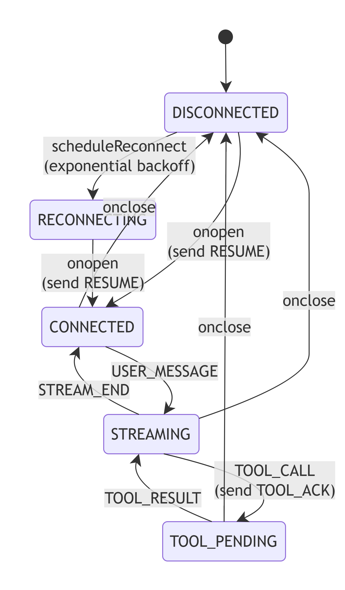
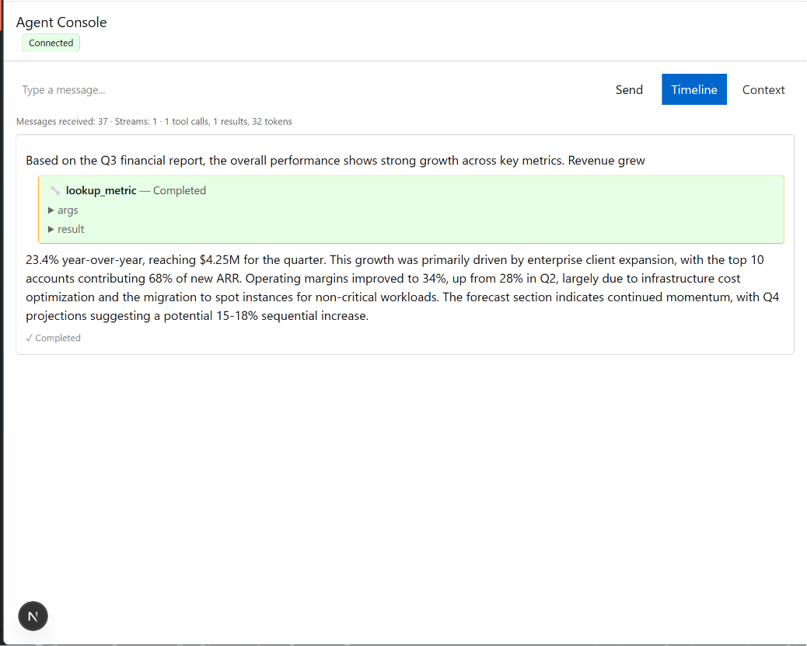
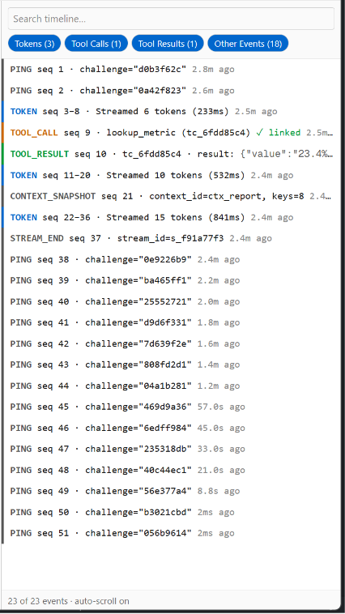
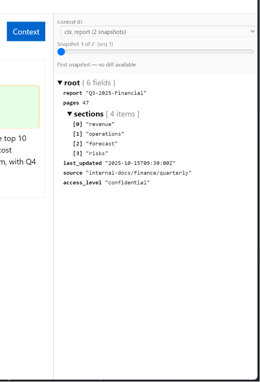

# Agent Console

A Next.js application that connects to the [agent-server](../hiring/June-2026_FullStackAI/agent-server/) mock backend over WebSocket, renders streaming AI responses with mid-stream tool call interruptions, displays a live agent trace timeline, includes a context inspector with diffs, and survives the backend's chaos mode without crashing or losing state.

This is a **systems exercise** — the goal is correct behaviour under stress (chaos mode, dropped connections, out-of-order messages, oversized payloads), not visual polish.

## My Architectural approach

This app acts as a thin React layer over the state machine that owns the WebSocket lifecycle. The chat panel, the trace timeline, and the context inspector are three different projections of the same protocol event log — they read from one source of truth (the Zustand store) and never duplicate state.

The core data path is:

```
wire frame
  → parseMessage (never throws, validates type+seq)
  → addTrace (every event, including PINGs and out-of-order arrivals)
  → ReorderBuffer (dedup, in-order, gap-immune, resync-on-large-gap)
  → addMessage (only for in-order, non-heartbeat events)
  → getStreams / buildTimelineRows / getContexts (pure selectors)
  → React components (memoized for per-token re-render isolation)
```

PING heartbeats bypass the reorder pipeline and respond immediately (3s deadline). TOOL_ACKs are sent only **after** a TOOL_CALL has been confirmed in `seq` order and added to the store, so the server knows the card is rendered. CONTEXT_SNAPSHOTs are captured both in the trace log and in a per-`context_id` history for scrubbing.

## State machine

The WebSocket connection is a small state machine. Transitions happen on socket events, on protocol messages, and on user actions:



ASCII fallback for environments that don't render Mermaid:

```
              connect()
                │
                ▼
         ┌─────────────┐
         │ DISCONNECTED│◄────────────────────────┐
         └──────┬──────┘                         │
                │ onopen                         │
                ▼                                │
         ┌─────────────┐    onclose             │
         │  CONNECTED  │──────────────────────►  │
         └──────┬──────┘                         │
                │ USER_MESSAGE                   │
                ▼                                │
         ┌─────────────┐    onclose             │
         │  STREAMING  │──────────────────────►  │
         │             │                         │
         │  ┌────────┐ │                         │
         │  │TOOL_PEND│──TOOL_RESULT──┐         │
         │  └────────┘ │              │         │
         └──────┬──────┘              │         │
                │ STREAM_END          │         │
                ▼                     │         │
         ┌─────────────┐              │         │
         │  CONNECTED  │              │         │
         └─────────────┘              │         │
                                     │         │
            scheduleReconnect()───────┴─────────┘
              (exponential backoff 500ms→10s, capped)
```

- **DISCONNECTED → CONNECTED**: socket.onopen fires, sends `RESUME` with `last_seq` from store, primes the reorder buffer.
- **CONNECTED → STREAMING**: a `USER_MESSAGE` is sent. Streaming state is implicit — driven by message arrival, not a flag in the store.
- **STREAMING → TOOL_PENDING**: a `TOOL_CALL` arrives. Client sends `TOOL_ACK` only after the message has been added to the store (i.e., the card is renderable).
- **TOOL_PENDING → STREAMING**: a `TOOL_RESULT` arrives, completes the tool segment in place.
- **STREAMING → CONNECTED**: `STREAM_END` arrives.
- **any → DISCONNECTED → RECONNECTING**: socket.onclose triggers exponential backoff.
- **RECONNECTING → CONNECTED**: re-opens the socket, re-sends `RESUME`, server replays from `last_seq`.

PINGs are handled inline (response within 3s) and do not affect the connection state.

## How to run

### Prerequisites

- Node.js 20+
- Docker (for the agent-server)

### Step 1: Start the agent-server

```bash
cd ../hiring/June-2026_FullStackAI/agent-server
docker build -t agent-server .
docker run -p 4747:4747 agent-server              # normal mode
# or
docker run -p 4747:4747 agent-server --mode chaos  # chaos mode
```

Endpoints:
- `ws://localhost:4747/ws` — the WebSocket your client connects to
- `GET http://localhost:4747/health` — server health
- `GET http://localhost:4747/log` — JSON log of every client event the server recorded (use this to verify protocol compliance)
- `GET http://localhost:4747/reset` — clears the server's history and log

### Step 2: Install dependencies and run the console

```bash
npm install
npm run dev
```

Open `http://localhost:3000` in your browser.

### Step 3: Try it out

Send one of these messages in the input box:

| Message | What you'll see |
|---|---|
| `hello` | Plain token streaming, no tool calls |
| `summarise the q3 report` | One tool call (`lookup_metric`) mid-stream, then more text |
| `analyze the market` | Two sequential tool calls |
| `lookup deployment SLA` | Tool call **before** any tokens — text appears after the result |
| `schema for the large database` | 500KB+ context snapshot — Context panel shows the tree without freezing |

### Step 4: Verify protocol compliance

After a few exchanges, check the server's view of your client:

```bash
curl -s http://localhost:4747/log | python -m json.tool
```

Every `PONG`, `TOOL_ACK`, and `RESUME` should have `verdict: "ok"`. Any `verdict: "violation"` indicates a protocol issue (typically a late `TOOL_ACK` — must be sent within 5s of `TOOL_CALL`).

### Running tests

```bash
npm test           # 45 tests across buffer, chat selector, timeline, diff
npm run lint       # ESLint
npm run build      # production build (Next.js)
```

## Project structure

```
src/
├── app/
│   └── page.tsx                       # The page: chat panel + side panel
├── protocol/
│   ├── messages.ts                    # Discriminated union of all server messages
│   └── parser.ts                      # Safe JSON parser (never throws)
├── store/
│   ├── agentStore.ts                  # Zustand store: messages, trace, contexts, status
│   ├── selectors.ts                   # getStreams — chat panel projection
│   ├── timelineSelectors.ts           # buildTimelineRows, applyFilter
│   ├── selectors.test.ts
│   └── timelineSelectors.test.ts
├── types/
│   ├── chat.ts                        # ChatStream, StreamSegment
│   ├── context.ts                     # ContextSnapshot, DiffNode
│   └── trace.ts                       # TraceEntry, TimelineRow
├── utils/
│   ├── reorderBuffer.ts               # In-order, dedup, resync-on-large-gap
│   ├── reorderBuffer.test.ts
│   ├── diff.ts                        # Recursive JSON diff
│   └── diff.test.ts
├── websocket/
│   ├── socket.ts                      # Module-level SocketManager instance
│   └── socketManager.ts               # The state machine (connect, onmessage, etc.)
└── features/
    ├── chat/
    │   ├── ChatStreamView.tsx         # Renders one stream as a list of segments
    │   └── ToolCard.tsx               # Renders one tool call/result
    ├── common/
    │   └── StreamView.tsx
    ├── timeline/
    │   ├── Timeline.tsx               # The side panel
    │   ├── TimelineRow.tsx            # One row, memoized
    │   └── FilterBar.tsx
    └── context/
        ├── ContextInspector.tsx       # The context panel with history scrubber
        └── ContextTreeView.tsx         # Tree view using native <details>
```

## Screenshots




## Chaos mode behaviour

When the server is run with `--mode chaos`, the following are tested and handled:

- **Connection drop mid-stream**: socket.onclose triggers exponential backoff (500ms, 1s, 2s, 4s, capped at 10s), then reopens. The new connection sends `RESUME` with the last fully-processed `seq`, the server replays missed events, the buffer deduplicates, and the chat panel stitches them in. The connection badge turns red within ~500ms and stays red during the disconnect.
- **Out-of-order delivery**: messages with `seq` values that are not in arrival order. The `ReorderBuffer` holds them and drains in `seq` order. Small gaps (< 10) are treated as chaos reorder; large gaps (≥ 10) trigger a full resync (the server has been reset).
- **Duplicate messages**: deduped by `seq` via the buffer's `seenSeq` Set.
- **Latency spikes**: the buffer accumulates; nothing is lost.
- **Rapid tool calls**: each `TOOL_CALL` opens a new segment. The next text segment opens **after** the tool, not before, so two tool calls stack visibly.
- **Corrupt heartbeat (empty `challenge`)**: PONG is still sent with `echo: ""`; the connection stays alive.
- **Oversized context (500KB+)**: the context inspector uses native `<details>` for collapse, so unmounted children don't enter the DOM. The chat panel is unaffected.


